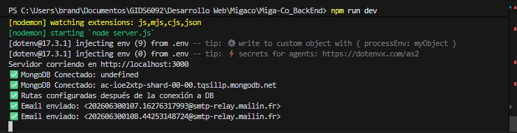
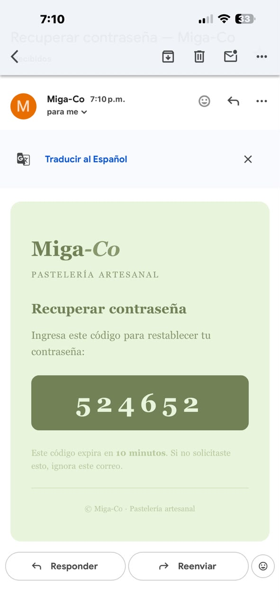
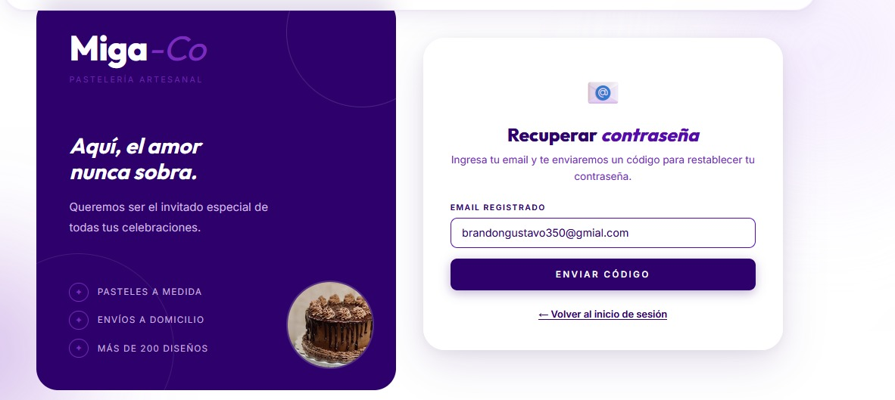
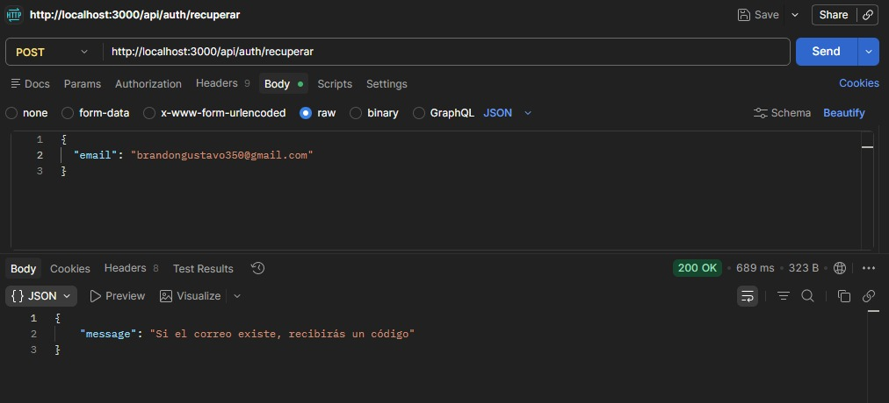
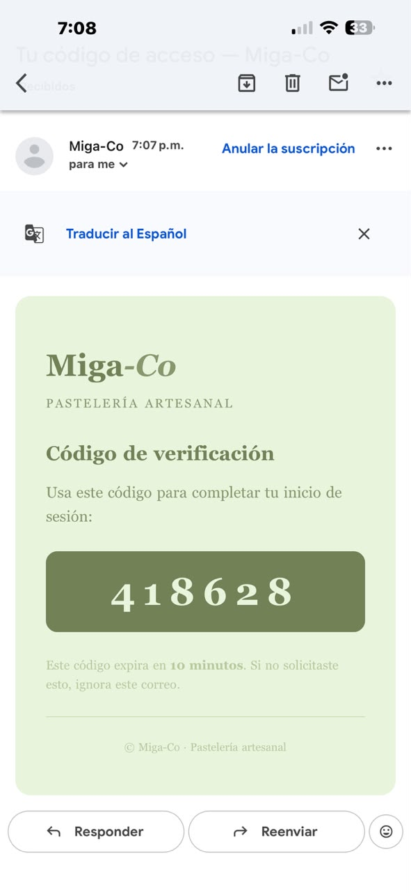

# Integración de APIs de Terceros — Miga Co. Backend

Este documento detalla la integración del servicio de terceros utilizado en el backend de **Miga Co.**, incluyendo los archivos de configuración, rutas, controladores, servicios y la evidencia visual de consumo de cada flujo en Postman, correo recibido y consola de logs.

---

## 1. Identificación de la API

* **Proveedor**: Brevo (anteriormente conocido como Sendinblue).
* **Servicio**: API de Correo Electrónico Transaccional (SMTP).
* **Dependencia Node.js**: Aunque el proyecto incluye `@getbrevo/brevo` en las dependencias, la integración técnica se realiza de forma directa mediante peticiones HTTP con **`axios`** para mayor flexibilidad.

---

## 2. Propósito de Negocio (¿Para qué se utiliza?)

La API resuelve dos flujos fundamentales de seguridad y soporte para el usuario en la tienda virtual de la pastelería:

1. **Código de Acceso OTP para Autenticación de Dos Factores (2FA)**:
   Cuando un usuario inicia sesión y tiene el doble factor activado, se le envía un código numérico temporal al correo electrónico registrado para verificar su identidad antes de otorgar el token JWT de acceso.
2. **Código de Recuperación de Contraseña**:
   Permite al usuario recibir un código de un solo uso por correo para restablecer sus credenciales de manera segura en caso de olvido.

---

## 3. Inicialización del Servidor

Cuando el backend se inicializa y se conecta correctamente a MongoDB, se prepara el entorno para escuchar peticiones en el puerto local:

**Evidencia: Servidor corriendo y Base de Datos conectada:**

---

## 4. Flujo 1: Registro y Autenticación con Doble Factor (2FA)

### Paso A: Registro de Usuario
El flujo inicia con la creación de una cuenta en el sistema.

* **Método**: `POST`
* **Ruta**: `/api/auth/registro`
* **Evidencia en Postman:**
  

### Paso B: Activación de 2FA
Una vez registrado, el usuario puede activar o desactivar la verificación de dos factores.

* **Método**: `PUT`
* **Ruta**: `/api/auth/2fa/toggle`
* **Evidencia en Postman:**
  

### Paso C: Intento de Inicio de Sesión (Dispara API de Brevo)
Al loguearse con la cuenta que tiene 2FA activo, el backend generará el código OTP y lo enviará al correo vía Brevo.

* **Método**: `POST`
* **Ruta**: `/api/auth/login`
* **Evidencia en Postman (Código Requerido):**
  

* **Evidencia: Correo OTP Recibido en la bandeja de entrada:**
  

### Paso D: Verificación de Código 2FA (Login Completo)
El usuario ingresa el código numérico recibido en su correo para terminar de autenticarse de forma segura.

* **Método**: `POST`
* **Ruta**: `/api/auth/2fa/verificar`
* **Evidencia en Postman:**
  

* **Evidencia: Logs en consola del flujo completo 2FA:**
  

---

## 5. Flujo 2: Recuperación de Contraseña

### Paso A: Solicitar código de recuperación (Dispara API de Brevo)
El usuario introduce su correo electrónico para iniciar el proceso de recuperación.

* **Método**: `POST`
* **Ruta**: `/api/auth/recuperar`
* **Evidencia en Postman:**
  

* **Evidencia: Correo de recuperación recibido en bandeja de entrada:**
  

### Paso B: Verificar código de recuperación
Se introduce el código OTP recibido para verificar que el cliente es el dueño de la cuenta y generar el token de restablecimiento.

* **Método**: `POST`
* **Ruta**: `/api/auth/recuperar/verificar`
* **Evidencia en Postman:**
  

### Paso C: Establecer nueva contraseña
Con el `reset_token` obtenido, el usuario puede finalmente guardar su nueva contraseña.

* **Método**: `POST`
* **Ruta**: `/api/auth/recuperar/cambiar`
* **Evidencia en Postman:**
  

* **Evidencia: Logs en consola del flujo completo de recuperación:**
  

---

## 6. Manejo de Errores y Diagnóstico

### Error común: API Key no autorizada o no encontrada (`unauthorized`)
Si la API Key ingresada en el archivo `.env` (`BREVO_API_KEY`) no está habilitada o fue borrada del panel de Brevo, el backend atrapará el error de axios y mostrará un diagnóstico en consola:

**Evidencia de log de error por API Key inválida:**

---

## 7. Pros y Contras de la Integración

### Pros:
* **Funciona en Producción (Diferencia clave con Nodemailer/SMTP personal)**: A diferencia de utilizar `nodemailer` configurado con cuentas personales (como Gmail), que suelen fallar en producción debido a los bloqueos de seguridad de Google, autenticación obligatoria por app y restricciones de IP, la API de Brevo está diseñada específicamente para producción, garantizando una alta tasa de entregabilidad y evitando que los correos terminen en la bandeja de Spam.
* **Capa Gratuita Generosa**: Permite enviar hasta 300 correos al día de forma gratuita, ideal para la fase de desarrollo y el lanzamiento inicial de Miga Co.
* **Métricas y Monitoreo**: Brevo ofrece un panel de administración para visualizar tasas de entrega, aperturas, rebotes (bounces) y fallas técnicas.
* **Integración Limpia**: Se consume mediante peticiones HTTP directas con `axios`, eliminando la necesidad de configurar servidores de correo locales o lidiar con protocolos SMTP complejos.

### Contras:
* **Límite de Envío**: Si se excede el límite de 300 correos diarios en la capa gratuita, el servicio requiere de un plan de pago.
* **Dependencia Externa**: Si el servicio de Brevo experimenta una caída en sus servidores, funciones clave como el inicio de sesión 2FA y la recuperación de contraseñas no estarán disponibles momentáneamente.
