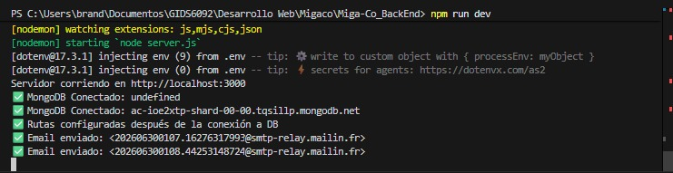
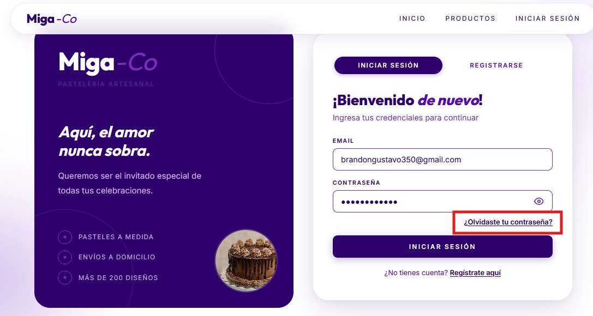
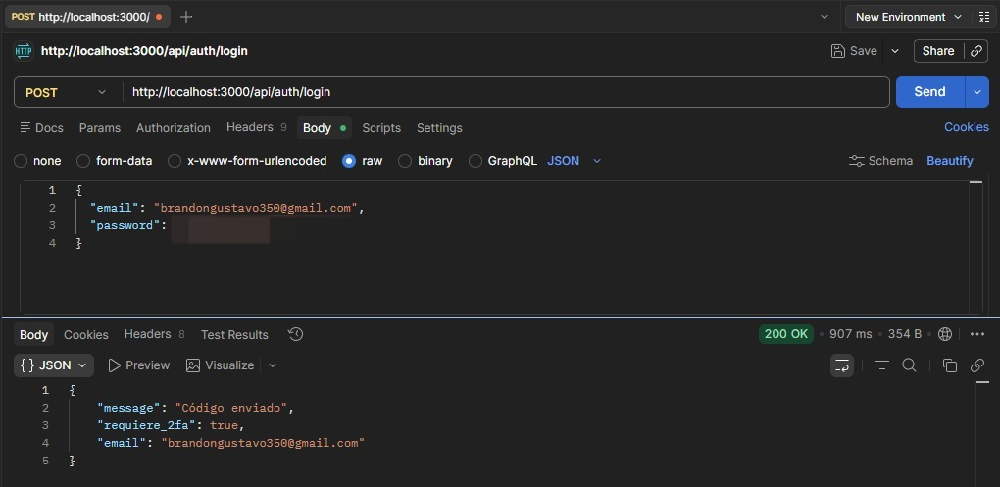
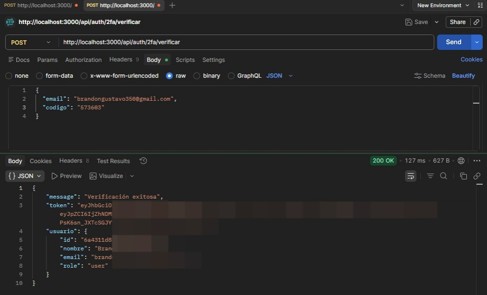
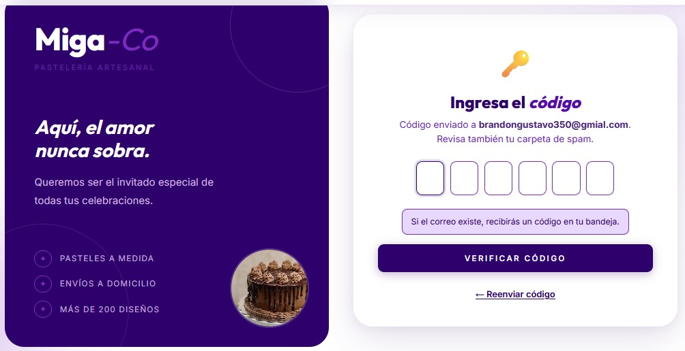
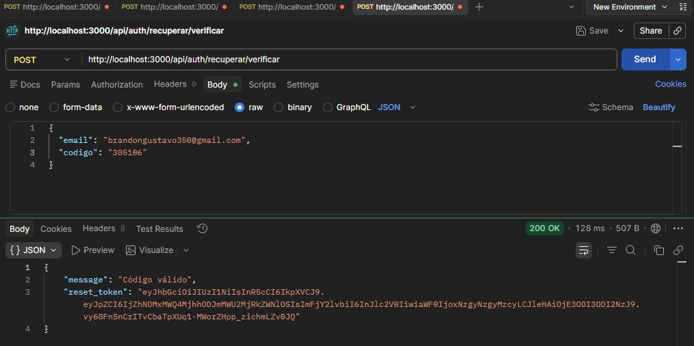
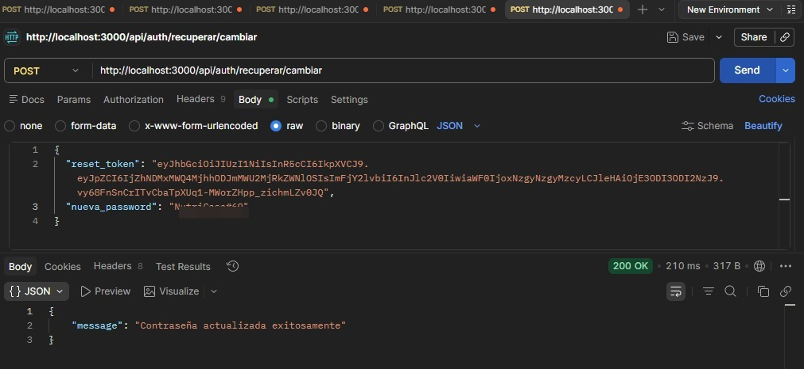
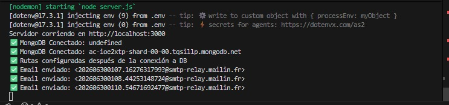

# Integración de APIs de Terceros — Miga Co. Backend

Este documento detalla la integración de la API de Brevo en el backend de **Miga Co.**, incluyendo los archivos de configuración, rutas, controladores, servicios y la evidencia visual de consumo de cada flujo en Postman, el correo recibido, el frontend y la consola de logs.

---

## 1. Identificación de la API

* **Proveedor**: Brevo (anteriormente conocido como Sendinblue).
* **Servicio**: API de Correo Electrónico Transaccional (SMTP).
* **Dependencia Node.js**: Aunque el proyecto incluye `@getbrevo/brevo` en las dependencias, la integración técnica se realiza de forma directa mediante peticiones HTTP con **`axios`** para mayor flexibilidad.

---

## 2. Propósito de Negocio (¿Para qué se utiliza?)

La API resuelve dos flujos fundamentales de seguridad y soporte para el usuario en la tienda virtual de la pastelería:

1. **Código de Acceso OTP para Autenticación de Dos Factores (2FA)**:
   Cuando un usuario inicia sesión y tiene el doble factor activado, se le envía un código numérico temporal al correo electrónico registrado para verificar su identidad antes de otorgar el token JWT de acceso.
2. **Código de Recuperación de Contraseña**:
   Permite al usuario recibir un código de un solo uso por correo para restablecer sus credenciales de manera segura en caso de olvido.

---

## 3. Inicialización del Servidor y Conexión

Al iniciar el backend, se realiza la conexión a MongoDB y se inicializan las rutas.

**Evidencia: Servidor corriendo y Base de Datos conectada:**

---

## 4. Flujo de Autenticación de Dos Factores (2FA)

### Paso A: Inicio de Sesión e Identificación de Cuenta
El usuario accede a la pantalla de login del frontend para ingresar sus datos.

### Paso B: Login y requerimiento de 2FA
Al enviar las credenciales, el backend valida que la cuenta requiere verificación y le indica al frontend que debe ingresar un código OTP.
* **Método**: `POST`
* **Ruta**: `/api/auth/login`

### Paso C: Recepción del Código OTP en el Correo (Enviado por Brevo)
El usuario recibe en su bandeja de entrada el correo electrónico con el código numérico de acceso.

### Paso D: Pantalla de Verificación en el Frontend
La interfaz del frontend solicita al usuario que ingrese el código OTP que acaba de recibir por correo.

### Paso E: Verificación del Código OTP
Se envía el código recibido para completar el proceso de inicio de sesión y obtener el token JWT de acceso definitivo.
* **Método**: `POST`
* **Ruta**: `/api/auth/2fa/verificar`

---

## 5. Flujo de Recuperación de Contraseña

### Paso A: Pantalla de Solicitud de Recuperación en el Frontend
El usuario que ha olvidado su contraseña ingresa su correo electrónico para iniciar el proceso de restauración.

### Paso B: Solicitud de Recuperación
El backend procesa la petición y llama a la API de Brevo para mandar el código de recuperación si el correo electrónico existe en el sistema.
* **Método**: `POST`
* **Ruta**: `/api/auth/recuperar`

### Paso C: Recepción del Correo de Recuperación (Enviado por Brevo)
El usuario recibe en su correo el código temporal de un solo uso para restablecer su contraseña.

### Paso D: Pantalla de Ingreso de Código en el Frontend
La interfaz del frontend le solicita al usuario que introduzca el código de seguridad de recuperación de contraseña.

### Paso E: Verificación del Código de Recuperación
El código introducido se valida en el servidor, retornando un `reset_token` temporal para autorizar el cambio de contraseña.
* **Método**: `POST`
* **Ruta**: `/api/auth/recuperar/verificar`

### Paso F: Establecer Nueva Contraseña
Se envía la nueva contraseña junto con el `reset_token` para actualizar las credenciales de forma definitiva en la base de datos.
* **Método**: `POST`
* **Ruta**: `/api/auth/recuperar/cambiar`

---

## 6. Evidencia de Logs en la Consola del Servidor

Cuando los correos electrónicos se envían exitosamente a través de la integración de Brevo, el servidor imprime en consola el registro correspondiente con el ID de mensaje devuelto por la API externa:

**Evidencia de logs en consola:**

---

## 7. Pros y Contras de la Integración

### Pros:
* **Funciona en Producción (Diferencia clave con Nodemailer/SMTP personal)**: A diferencia de utilizar `nodemailer` configurado con cuentas personales (como Gmail), que suelen fallar en producción debido a los bloqueos de seguridad de Google, autenticación obligatoria por app y restricciones de IP, la API de Brevo está diseñada específicamente para producción, garantizando una alta tasa de entregabilidad y evitando que los correos terminen en la bandeja de Spam.
* **Capa Gratuita Generosa**: Permite enviar hasta 300 correos al día de forma gratuita, ideal para la fase de desarrollo y el lanzamiento inicial de Miga Co.
* **Métricas y Monitoreo**: Brevo ofrece un panel de administración para visualizar tasas de entrega, aperturas, rebotes (bounces) y fallas técnicas.
* **Integración Limpia**: Se consume mediante peticiones HTTP directas con `axios`, eliminando la necesidad de configurar servidores de correo locales o lidiar con protocolos SMTP complejos.

### Contras:
* **Límite de Envío**: Si se excede el límite de 300 correos diarios en la capa gratuita, el servicio requiere de un plan de pago.
* **Dependencia Externa**: Si el servicio de Brevo experimenta una caída en sus servidores, funciones clave como el inicio de sesión 2FA y la recuperación de contraseñas no estarán disponibles momentáneamente.
