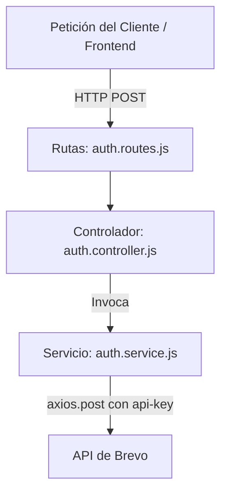

# Integración de APIs de Terceros — Miga Co. Backend

Este documento detalla la integración del servicio de terceros utilizado en el backend de **Miga Co.**, incluyendo los archivos de configuración, rutas, controladores y servicios involucrados en su flujo.

---

## 1. Identificación de la API

* **Proveedor**: Brevo (anteriormente conocido como Sendinblue).
* **Servicio**: API de Correo Electrónico Transaccional (SMTP).
* **Dependencia Node.js**: Aunque el proyecto incluye `@getbrevo/brevo` en las dependencias, la integración técnica se realiza de forma directa mediante peticiones HTTP con **`axios`** para mayor flexibilidad.

---

## 2. Propósito de Negocio (¿Para qué se utiliza?)

La API resuelve dos flujos fundamentales de seguridad y soporte para el usuario en la tienda virtual de la pastelería:

1. **Código de Acceso OTP para Autenticación de Dos Factores (2FA)**:
   Cuando un usuario inicia sesión y tiene el doble factor activado, se le envía un código numérico temporal al correo electrónico registrado para verificar su identidad antes de otorgar el token JWT de acceso.
2. **Código de Recuperación de Contraseña**:
   Permite al usuario recibir un código de un solo uso por correo para restablecer sus credenciales de manera segura en caso de olvido.

---

## 3. Implementación y Flujo Técnico (¿Cómo se utiliza?)

### Configuración del Entorno (`.env`)
Las credenciales necesarias se encuentran en el archivo [.env del backend](file:///c:/Users/brand/Documentos/GIDS6092/Desarrollo%20Web/Migaco/Miga-Co_BackEnd/.env):
* `BREVO_API_KEY`: API Key estática de autenticación.
* `BREVO_SENDER_EMAIL`: Correo emisor autorizado en Brevo (`karenpadron0608@gmail.com`).
* `BREVO_SENDER_NAME`: Nombre del emisor visible para los clientes (`Miga-Co`).

### Arquitectura de Archivos y Funciones

El flujo de integración está estructurado de la siguiente manera:



#### A. Definición de Rutas
En el archivo [auth.routes.js](file:///c:/Users/brand/Documentos/GIDS6092/Desarrollo%20Web/Migaco/Miga-Co_BackEnd/src/routes/auth.routes.js):
* `POST /login`: Ruta encargada del inicio de sesión (dispara el código 2FA si está configurado).
* `POST /recuperar`: Ruta encargada de recibir la solicitud de recuperación de contraseña.

#### B. Capa de Controladores
En el archivo [auth.controller.js](file:///c:/Users/brand/Documentos/GIDS6092/Desarrollo%20Web/Migaco/Miga-Co_BackEnd/src/controllers/auth.controller.js):
* `async login(req, res)`: Valida credenciales e invoca el servicio de login.
* `async solicitarRecuperacion(req, res)`: Recibe el correo electrónico del cliente e invoca el servicio de recuperación.

#### C. Capa de Servicios (Consumo de la API)
En el archivo [auth.service.js](file:///c:/Users/brand/Documentos/GIDS6092/Desarrollo%20Web/Migaco/Miga-Co_BackEnd/src/services/auth.service.js) es donde reside el consumo directo de la API:
* **Función `enviarEmail(destinatario, asunto, html)`**:
  * Realiza una petición `POST` usando `axios` a `https://api.brevo.com/v3/smtp/email`.
  * Envía el header de autenticación `'api-key': process.env.BREVO_API_KEY`.
  * Registra en consola el ID de respuesta exitoso: `console.log('✅ Email enviado:', response.data.messageId);`.
* **Función `login(email, password)`**:
  * Verifica si el usuario tiene el doble factor activo, genera un código temporal de 6 dígitos con vigencia de 10 minutos y lo almacena.
  * Llama a `enviarEmail` enviando la plantilla HTML del código OTP.
* **Función `solicitarRecuperacion(email)`**:
  * Busca al usuario por email, genera un código de recuperación temporal y lo almacena.
  * Llama a `enviarEmail` enviando la plantilla HTML correspondiente.

---

## 4. Evidencia de Integración y Respuestas

### Estructura de la Petición JSON (Payload a Brevo)
```json
{
  "sender": {
    "email": "karenpadron0608@gmail.com",
    "name": "Miga-Co 🎂"
  },
  "to": [
    {
      "email": "correo-cliente@gmail.com"
    }
  ],
  "subject": "Tu código de acceso — Miga-Co",
  "htmlContent": "HTML estructurado con el diseño de Miga-Co y el código temporal."
}
```

### Respuesta de Éxito de la API de Brevo
Cuando la llamada HTTP es correcta, Brevo responde con estado `201 Created` y el identificador del mensaje:
```json
{
  "messageId": "<202606300047.123456789@smtp-relay.mailin.fr>"
}
```

### Logs de la Consola del Servidor (Evidencia Backend)
```bash
[nodemon] starting `node server.js`
Servidor corriendo en http://localhost:3000
✅ MongoDB Conectado: 127.0.0.1
✅ Rutas configuradas después de la conexión a DB

✅ Email enviado: <202606300047.123456789@smtp-relay.mailin.fr>
```

---

## 5. Pros y Contras de la Integración

### Pros:
* **Funciona en Producción (Diferencia clave con Nodemailer/SMTP personal)**: A diferencia de utilizar `nodemailer` configurado con cuentas personales (como Gmail), que suelen fallar en producción debido a los bloqueos de seguridad de Google, autenticación obligatoria por app y restricciones de IP, la API de Brevo está diseñada específicamente para producción, garantizando una alta tasa de entregabilidad y evitando que los correos terminen en la bandeja de Spam.
* **Capa Gratuita Generosa**: Permite enviar hasta 300 correos al día de forma gratuita, ideal para la fase de desarrollo y el lanzamiento inicial de Miga Co.
* **Métricas y Monitoreo**: Brevo ofrece un panel de administración para visualizar tasas de entrega, aperturas, rebotes (bounces) y fallas técnicas.
* **Integración Limpia**: Se consume mediante peticiones HTTP directas con `axios`, eliminando la necesidad de configurar servidores de correo locales o lidiar con protocolos SMTP complejos.

### Contras:
* **Límite de Envío**: Si se excede el límite de 300 correos diarios en la capa gratuita, el servicio requiere de un plan de pago.
* **Dependencia Externa**: Si el servicio de Brevo experimenta una caída en sus servidores, funciones clave como el inicio de sesión 2FA y la recuperación de contraseñas no estarán disponibles momentáneamente.

